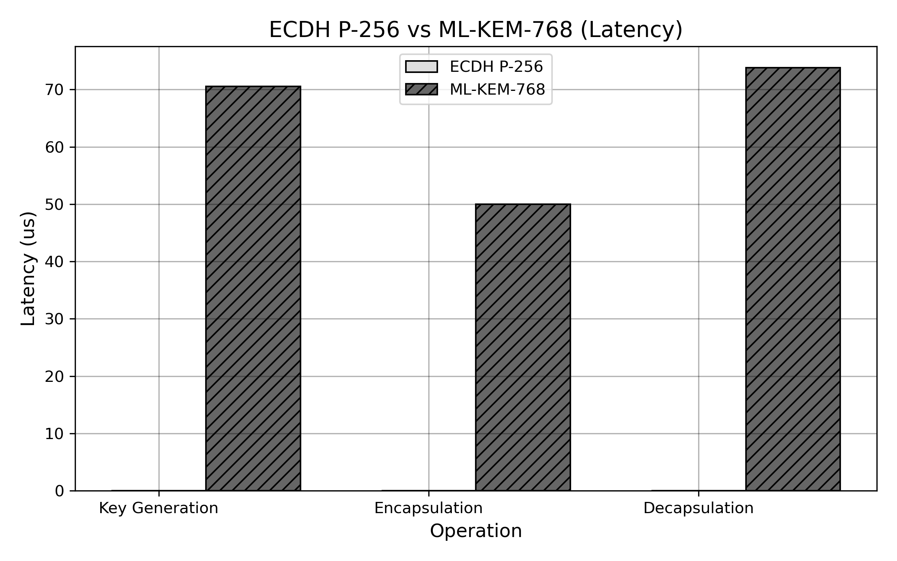
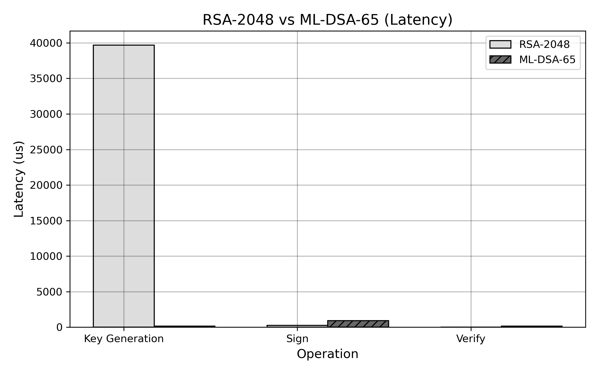
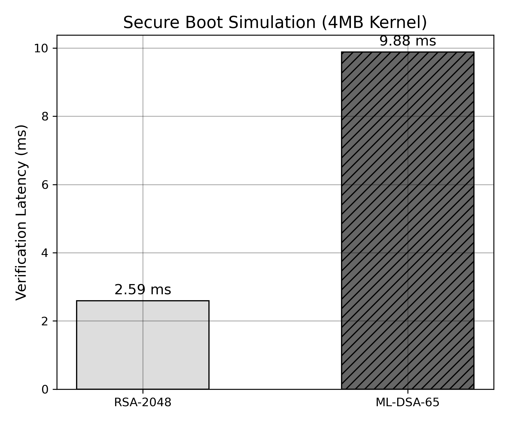
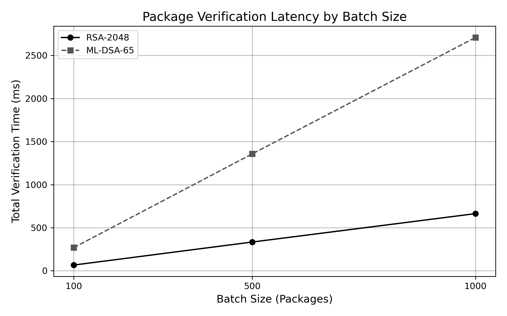
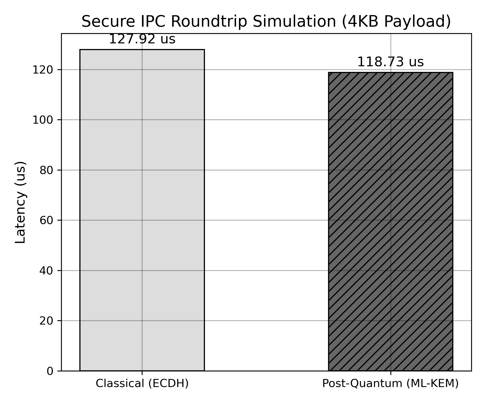

# PQC Benchmark Suite for XenevaOS — Final Report

## System Information
- **Compiler:** Clang
- **OpenSSL:** OpenSSL 3.5.7 9 Jun 2026
- **CPU:** N/A
- **Kernel:** 7.1.3-201.fc44.x86_64
- **RAM:** 30Gi

## Experiment 1: ECDH P-256 vs ML-KEM-768
Key establishment benchmarking comparing classical Elliptic Curve Diffie-Hellman with Post-Quantum ML-KEM.

| Algorithm   | Compiler   | CompilerVersion   | OptimizationFlags                  | CPUModel                                   | OS    | Timestamp               | Operation         |   Iterations |   Average(us) |   Median(us) |   Minimum(us) |   Maximum(us) |   StdDev(us) |   CI95(us) |   OpsPerSecond |   RelativeSlowdown |   OverheadPct |
|:------------|:-----------|:------------------|:-----------------------------------|:-------------------------------------------|:------|:------------------------|:------------------|-------------:|--------------:|-------------:|--------------:|--------------:|-------------:|-----------:|---------------:|-------------------:|--------------:|
| ECDH-P256   | Clang      | Clang 22.1.8      | -march=native -fomit-frame-pointer | AMD Ryzen 7 8845HS w/ Radeon 780M Graphics | Linux | 2026-07-19 16:01:30 IST | Key Generation    |         5000 |         12.59 |        12.49 |         12.24 |         27.37 |         0.68 |       0.02 |       79452.2  |               1    |          0    |
| ECDH-P256   | Clang      | Clang 22.1.8      | -march=native -fomit-frame-pointer | AMD Ryzen 7 8845HS w/ Radeon 780M Graphics | Linux | 2026-07-19 16:01:30 IST | Shared Secret     |         5000 |         49.49 |        49.26 |         48.86 |        107.1  |         1.24 |       0.03 |       20207.2  |               1    |          0    |
| ECDH-P256   | Clang      | Clang 22.1.8      | -march=native -fomit-frame-pointer | AMD Ryzen 7 8845HS w/ Radeon 780M Graphics | Linux | 2026-07-19 16:01:30 IST | Full Key Exchange |         5000 |         74.97 |        74.64 |         73.72 |        124.18 |         1.52 |       0.04 |       13338.9  |               1    |          0    |
| ML-KEM-768  | Clang      | Clang 22.1.8      | -march=native -fomit-frame-pointer | AMD Ryzen 7 8845HS w/ Radeon 780M Graphics | Linux | 2026-07-19 16:01:30 IST | Key Generation    |         5000 |         40.93 |        40.7  |         40.02 |        112.21 |         1.56 |       0.04 |       24431.2  |               3.25 |        225.21 |
| ML-KEM-768  | Clang      | Clang 22.1.8      | -march=native -fomit-frame-pointer | AMD Ryzen 7 8845HS w/ Radeon 780M Graphics | Linux | 2026-07-19 16:01:30 IST | Encapsulation     |         5000 |         29.59 |        29.42 |         29.24 |         67.98 |         1.07 |       0.03 |       33792.1  |               1    |          0    |
| ML-KEM-768  | Clang      | Clang 22.1.8      | -march=native -fomit-frame-pointer | AMD Ryzen 7 8845HS w/ Radeon 780M Graphics | Linux | 2026-07-19 16:01:30 IST | Decapsulation     |         5000 |         43.93 |        43.73 |         43.49 |         81.63 |         1.08 |       0.03 |       22762    |               1    |          0    |
| ML-KEM-768  | Clang      | Clang 22.1.8      | -march=native -fomit-frame-pointer | AMD Ryzen 7 8845HS w/ Radeon 780M Graphics | Linux | 2026-07-19 16:01:30 IST | Full Key Exchange |         5000 |        115.43 |       114.6  |        113.77 |        816.22 |        14.22 |       0.39 |        8663.28 |               1.54 |         53.97 |

## Experiment 2: RSA-2048 vs ML-DSA-65
Digital signature benchmarking comparing classical RSA with Post-Quantum ML-DSA.

| Algorithm   | Compiler   | CompilerVersion   | OptimizationFlags                  | CPUModel                                   | OS    | Timestamp               | Operation      |   Iterations |   Average(us) |   Median(us) |   Minimum(us) |   Maximum(us) |   StdDev(us) |   CI95(us) |   OpsPerSecond |   RelativeSlowdown |   OverheadPct |
|:------------|:-----------|:------------------|:-----------------------------------|:-------------------------------------------|:------|:------------------------|:---------------|-------------:|--------------:|-------------:|--------------:|--------------:|-------------:|-----------:|---------------:|-------------------:|--------------:|
| RSA-2048    | Clang      | Clang 22.1.8      | -march=native -fomit-frame-pointer | AMD Ryzen 7 8845HS w/ Radeon 780M Graphics | Linux | 2026-07-19 16:01:32 IST | Key Generation |          100 |      39697.2  |     35883    |       7714.21 |     128280    |     23463.8  |    4598.91 |          25.19 |               1    |          0    |
| RSA-2048    | Clang      | Clang 22.1.8      | -march=native -fomit-frame-pointer | AMD Ryzen 7 8845HS w/ Radeon 780M Graphics | Linux | 2026-07-19 16:01:32 IST | Sign           |          100 |        237.49 |       229.12 |        228.74 |        470.84 |        41.17 |       8.07 |        4210.76 |               1    |          0    |
| RSA-2048    | Clang      | Clang 22.1.8      | -march=native -fomit-frame-pointer | AMD Ryzen 7 8845HS w/ Radeon 780M Graphics | Linux | 2026-07-19 16:01:32 IST | Verify         |          100 |         17.75 |        17.67 |         17.59 |         21.42 |         0.52 |       0.1  |       56346.3  |               1    |          0    |
| ML-DSA-65   | Clang      | Clang 22.1.8      | -march=native -fomit-frame-pointer | AMD Ryzen 7 8845HS w/ Radeon 780M Graphics | Linux | 2026-07-19 16:01:32 IST | Key Generation |          100 |        161.13 |       160.18 |        158.61 |        202.67 |         4.51 |       0.88 |        6206.14 |               0    |        -99.59 |
| ML-DSA-65   | Clang      | Clang 22.1.8      | -march=native -fomit-frame-pointer | AMD Ryzen 7 8845HS w/ Radeon 780M Graphics | Linux | 2026-07-19 16:01:32 IST | Sign           |          100 |        909.8  |       718.01 |        304.35 |       3762.76 |       724.5  |     142    |        1099.14 |               3.83 |        283.1  |
| ML-DSA-65   | Clang      | Clang 22.1.8      | -march=native -fomit-frame-pointer | AMD Ryzen 7 8845HS w/ Radeon 780M Graphics | Linux | 2026-07-19 16:01:32 IST | Verify         |          100 |        159.72 |       159.01 |        158.37 |        166.02 |         1.73 |       0.34 |        6260.8  |               9    |        799.99 |

## Experiment 3: Secure Boot Simulation
Simulating verification latency during kernel boot for a 4MB payload.

| Algorithm   | Compiler   | CompilerVersion   | OptimizationFlags                  | CPUModel                                   | OS    | Timestamp               | Operation         |   Iterations |   Average(us) |   Median(us) |   Minimum(us) |   Maximum(us) |   StdDev(us) |   CI95(us) |   OpsPerSecond |   RelativeSlowdown |   OverheadPct |
|:------------|:-----------|:------------------|:-----------------------------------|:-------------------------------------------|:------|:------------------------|:------------------|-------------:|--------------:|-------------:|--------------:|--------------:|-------------:|-----------:|---------------:|-------------------:|--------------:|
| RSA-2048    | Clang      | Clang 22.1.8      | -march=native -fomit-frame-pointer | AMD Ryzen 7 8845HS w/ Radeon 780M Graphics | Linux | 2026-07-19 16:01:41 IST | Boot Verification |         1000 |       2282.6  |      2274.43 |       2270.64 |       3755.06 |        90.85 |       5.63 |          438.1 |               1    |          0    |
| ML-DSA-65   | Clang      | Clang 22.1.8      | -march=native -fomit-frame-pointer | AMD Ryzen 7 8845HS w/ Radeon 780M Graphics | Linux | 2026-07-19 16:01:41 IST | Boot Verification |         1000 |       8339.99 |      8270.06 |       8222.95 |       9911.11 |       207.32 |      12.85 |          119.9 |               3.65 |        265.37 |

## Experiment 4: Package Verification
Simulating software supply chain batch verification (100, 500, 1000 packages of 1MB each).

| Algorithm   | Compiler   | CompilerVersion   | OptimizationFlags                  | CPUModel                                   | OS    | Timestamp               | Operation            |   Iterations |      Average(us) |       Median(us) |      Minimum(us) |      Maximum(us) |   StdDev(us) |   CI95(us) |   OpsPerSecond |   RelativeSlowdown |   OverheadPct |
|:------------|:-----------|:------------------|:-----------------------------------|:-------------------------------------------|:------|:------------------------|:---------------------|-------------:|-----------------:|-----------------:|-----------------:|-----------------:|-------------:|-----------:|---------------:|-------------------:|--------------:|
| RSA-2048    | Clang      | Clang 22.1.8      | -march=native -fomit-frame-pointer | AMD Ryzen 7 8845HS w/ Radeon 780M Graphics | Linux | 2026-07-19 16:01:53 IST | Verify 100 Packages  |           10 |  58381.2         |  58374.7         |  58349.6         |  58428.3         |        29.74 |      18.43 |          17.13 |               1    |          0    |
| ML-DSA-65   | Clang      | Clang 22.1.8      | -march=native -fomit-frame-pointer | AMD Ryzen 7 8845HS w/ Radeon 780M Graphics | Linux | 2026-07-19 16:01:53 IST | Verify 100 Packages  |           10 | 220150           | 219717           | 219374           | 221398           |       813.04 |     503.93 |           4.54 |               3.77 |        277.09 |
| RSA-2048    | Clang      | Clang 22.1.8      | -march=native -fomit-frame-pointer | AMD Ryzen 7 8845HS w/ Radeon 780M Graphics | Linux | 2026-07-19 16:01:53 IST | Verify 500 Packages  |           10 | 292604           | 292433           | 291515           | 294593           |      1038.62 |     643.75 |           3.42 |               1    |          0    |
| ML-DSA-65   | Clang      | Clang 22.1.8      | -march=native -fomit-frame-pointer | AMD Ryzen 7 8845HS w/ Radeon 780M Graphics | Linux | 2026-07-19 16:01:53 IST | Verify 500 Packages  |           10 |      1.09917e+06 |      1.09896e+06 |      1.09732e+06 |      1.10082e+06 |      1140.22 |     706.72 |           0.91 |               3.76 |        275.65 |
| RSA-2048    | Clang      | Clang 22.1.8      | -march=native -fomit-frame-pointer | AMD Ryzen 7 8845HS w/ Radeon 780M Graphics | Linux | 2026-07-19 16:01:53 IST | Verify 1000 Packages |           10 | 584911           | 584749           | 584546           | 586315           |       511.2  |     316.84 |           1.71 |               1    |          0    |
| ML-DSA-65   | Clang      | Clang 22.1.8      | -march=native -fomit-frame-pointer | AMD Ryzen 7 8845HS w/ Radeon 780M Graphics | Linux | 2026-07-19 16:01:53 IST | Verify 1000 Packages |           10 |      2.19784e+06 |      2.19785e+06 |      2.19583e+06 |      2.19976e+06 |      1236.61 |     766.46 |           0.45 |               3.76 |        275.76 |

## Experiment 5: Secure IPC Simulation
Simulating round-trip secure message passing (Keygen -> KDF -> AES Encrypt/Decrypt) on a 4KB payload.

| Algorithm            | Compiler   | CompilerVersion   | OptimizationFlags                  | CPUModel                                   | OS    | Timestamp               | Operation     |   Iterations |   Average(us) |   Median(us) |   Minimum(us) |   Maximum(us) |   StdDev(us) |   CI95(us) |   OpsPerSecond |   RelativeSlowdown |   OverheadPct |
|:---------------------|:-----------|:------------------|:-----------------------------------|:-------------------------------------------|:------|:------------------------|:--------------|-------------:|--------------:|-------------:|--------------:|--------------:|-------------:|-----------:|---------------:|-------------------:|--------------:|
| Classical (ECDH+AES) | Clang      | Clang 22.1.8      | -march=native -fomit-frame-pointer | AMD Ryzen 7 8845HS w/ Radeon 780M Graphics | Linux | 2026-07-19 16:02:46 IST | IPC Roundtrip |         5000 |        127.92 |       126.98 |        126.21 |        498.54 |         5.96 |       0.17 |        7817.14 |               1    |          0    |
| PQ (ML-KEM+AES)      | Clang      | Clang 22.1.8      | -march=native -fomit-frame-pointer | AMD Ryzen 7 8845HS w/ Radeon 780M Graphics | Linux | 2026-07-19 16:02:46 IST | IPC Roundtrip |         5000 |        118.73 |       117.61 |        116.53 |        844.62 |        18.78 |       0.52 |        8422.62 |               0.93 |         -7.19 |

---
*Report automatically generated by Stage 2 Python Analysis Pipeline.*
